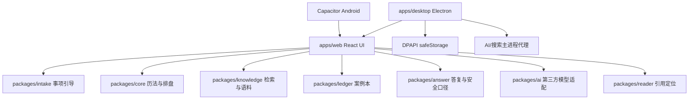

# 系统架构

## 总览

## 模块职责

| 路径 | 职责 | 约束 |
|---|---|---|
| `packages/core` | 天文、历法、八种术数引擎、插件契约与通用盘面 | 纯 TypeScript；排盘结果应确定、可复现 |
| `packages/intake` | 事项分类、问句质量、六步向导、playbook | 只组织输入和解释路径，不改变排盘算法 |
| `packages/knowledge` | CJK BM25、内置语料、IndexedDB 快照、引用补全 | 缓存必须随正文/元数据变化失效 |
| `packages/reader` | 典籍目录、引用模型、字符区间定位 | 负责定位，不负责排盘 |
| `packages/ledger` | 案例模型、配额、持久化、回标统计、导入导出 | 用户数据本地优先；外部导入必须运行时校验 |
| `packages/answer` | 答复模板、应期候选和敏感事项安全口径 | 不得给出医疗、法律、财务的确定性承诺 |
| `packages/ai` | Provider 配置、提示契约、网络客户端和响应解析 | AI 不算盘；所有输出标为 E 级并需人工核实 |
| `apps/web` | React 工作台和典籍阅读界面 | 同一套 UI 服务浏览器、Electron 和 Android |
| `apps/desktop` | Electron 窗口、DPAPI 密钥、AI/搜索 IPC 代理 | 外部页面不得导航进主窗口或调用受信 IPC |

## 排盘数据流

1. 用户选择事项和术数，`packages/intake` 给出问法与路径提示。
2. Web 入口向对应 `cast*`/`build*` 函数提交输入。
3. `packages/core` 生成带 `configHash` 的确定性盘面。
4. 插件规则返回带 `ruleId` 和 `CitationRef` 的判断依据。
5. `packages/knowledge` 按 `segId` 回链正文并补充 `charRange`。
6. `packages/answer` 组装白话、应期和安全声明。
7. 用户主动存档时，`packages/ledger` 保存盘面快照和证据引用。
8. 用户主动启用 AI 时，只把结构化盘面、规则和已检索证据发送给所选厂商。

## 知识库启动路径

典籍语料是单独的异步构建块。React 首屏先渲染工作台，再加载 `builtin` 语料：

1. 生成覆盖正文和关键元数据的 `corpusHash`。
2. 从 IndexedDB 读取元数据与 Retriever 快照。
3. 校验版本、段数、正文哈希，以及快照的 section/index 对应关系。
4. 命中时直接恢复索引；未命中或损坏时才重建 BM25 并回写。

这样避免把约 4.93 MB 的原典代码塞入首屏业务包，也避免二次启动仍重复分词建索引。

## 依赖方向

领域包通过公开入口互相引用，平台层依赖领域层。不要让 `packages/core` 反向依赖 React、Electron、IndexedDB 或 Node 文件系统。新增术数优先实现插件契约，再由 UI 注册，避免把算法写进 `App.tsx`。
